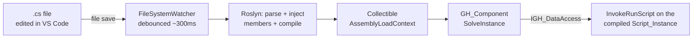

# CSHopper

Live-sync a plain `.cs` file edited in VS Code straight into a Grasshopper (Rhino 8)
canvas component — no more copy/pasting code between VS Code and the Grasshopper
C# script editor.

You keep writing the exact same boilerplate you already know:

```csharp
public class Script_Instance : GH_ScriptInstance
{
    private void RunScript(double width, double length, double height, ref object box)
    {
        // your code
    }
}
```

...in a normal `.cs` file, in whatever editor you like. Every time you save the file,
the CSHopper component on the canvas detects the change, recompiles it, resyncs its
input/output parameters to match the `RunScript` signature, and recomputes — live.

## How it works



1. **You edit and save** a plain `.cs` file containing a class that inherits
   `GH_ScriptInstance` with a `RunScript(...)` method — identical to Grasshopper's
   own native C# script component boilerplate.
2. A `FileSystemWatcher` on the component detects the change (debounced so partial
   writes from the editor don't trigger half-saved recompiles).
3. **Roslyn** (`Microsoft.CodeAnalysis.CSharp`) parses the file, finds the
   `RunScript` method, and reads its parameter list (names, types, `ref`/`out`,
   `List<T>` vs. single item) to figure out what the component's inputs/outputs
   should look like.
4. Grasshopper's native script editor also injects some members you don't write
   yourself (`RhinoDocument`, `GrasshopperDocument`, `Component`, `Iteration`,
   `Print(...)`, `Reflect(...)`, and the actual `InvokeRunScript` override that
   moves data in/out via `IGH_DataAccess`). CSHopper injects the same members into
   the syntax tree before compiling, so your visible code stays exactly what you'd
   write in the native editor.
5. The augmented source is compiled in-memory and loaded into a **collectible
   `AssemblyLoadContext`** (so old versions are unloaded/GC'd on every recompile —
   no memory leak from repeated edits).
6. The component's Grasshopper parameters (`Params.Input`/`Params.Output`) are
   diffed and resynced to match the new signature, then the solution is expired
   so Grasshopper recomputes with the new code.
7. On `SolveInstance`, the component instantiates the compiled `Script_Instance`
   type and calls its generated `InvokeRunScript(...)`, exactly like Grasshopper's
   own script component does internally.

## Project structure

```
src/
  CSHopper.Core/     Plain class library — the reusable engine.
                      ScriptCompiler.cs   Roslyn parse/inject/compile/load pipeline.
                      ScriptModels.cs     ScriptParameterInfo / ScriptCompileResult.
                      ParamTypeMap.cs     C# type -> Grasshopper IGH_Param mapping.
  CSHopper/          The actual Grasshopper plugin (builds to CSHopper.gha).
                      CSHopperComponent.cs  GH_Component + IGH_VariableParameterComponent:
                                            file watching, param sync, persistence,
                                            context menu (Select/Create/Open in VS Code).
                      CSHopperInfo.cs       GH_AssemblyInfo plugin metadata.
tools/
  TestHarness/       Standalone console app that compiles + invokes sample scripts
                      fully offline (no Rhino needed) via a fake IGH_DataAccess, to
                      validate the pipeline in isolation.
  inspect-gh-assembly.ps1   Reflection script used to inspect the installed
                            Grasshopper/RhinoCommon assemblies during development.
```

`CSHopper.Core` is kept as a separate plain library (rather than folding it into the
`.gha` project) so it can be referenced by a normal console exe for testing — a
project that directly references a `.gha`-producing project won't start correctly
(see note in the Core project if you're curious).

## Building & installing

Requires the .NET SDK and Rhino 8 installed locally (the `Grasshopper` NuGet package
is compile-only; Rhino supplies the real assemblies at runtime).

```powershell
cd src/CSHopper
dotnet build
```

A post-build step automatically copies the output to
`%AppData%\Grasshopper\Libraries\CSHopper\`, which is one of Grasshopper's default
plugin folders. **Rhino must be closed while building** — it locks the previously
loaded `.gha`/`.dll` files. After building, (re)start Rhino and open Grasshopper;
the component appears under the **CSHopper → Script** tab.

## Using the component

1. Drag the **CS Hopper** component onto the canvas.
2. Right-click → **Create New Script File...** (writes the native boilerplate to a
   `.cs` file you choose) or **Select Script File...** (point it at an existing one).
3. Right-click → **Open in VS Code** (requires the `code` CLI on PATH).
4. Edit `RunScript(...)` and save. The component recompiles and resyncs its
   parameters automatically within a fraction of a second.
5. Compile errors show up as a runtime error message on the component instead of
   crashing Grasshopper.

Supported parameter types: `object`, `string`, `bool`, `int`, `double`, `Point3d`,
`Vector3d`, `Plane`, `Line`, `Circle`, `Rectangle3d`, `Curve`, `Brep`, `Mesh`,
`Surface`, `GeometryBase`, `Guid`, `Color`, plus:

- `List<T>` of any of the above -> `GH_ParamAccess.list`.
- `DataTree<T>` of any of the above -> `GH_ParamAccess.tree`, using Grasshopper's own
  `Grasshopper.DataTree<T>` class (the same type the native script component uses).
  Reading an input tree parameter converts each branch item from the underlying
  `IGH_Goo` wrapper to `T` (via `IGH_Goo.CastTo<T>`, falling back to `ScriptVariable()`).
  Writing an output tree just calls `DA.SetDataTree(...)` directly, since
  `DataTree<T>` already implements Grasshopper's `IGH_DataTree`.

Anything unrecognized falls back to a generic object parameter.

## Sharing a definition with a colleague

The component embeds the **full source text** of your script directly into the
`.gh`/`.ghx` file itself (not just the file path), so the definition is
self-contained — just like Grasshopper's native script component:

- If the original `.cs` path exists on the machine opening the file, it's used
  (live-editing/watching resumes automatically).
- If it doesn't (e.g. a colleague on a different machine/folder layout), the
  component instead compiles and runs from the source embedded in the document,
  with a message noting the original file wasn't found.
- From there, **"Extract Script to File..."** lets your colleague save that
  embedded code out to a local `.cs` file and resume live editing/watching on
  their own machine.

**What your colleague needs, once, to open and run the definition:**
- Rhino 8 with Grasshopper.
- `CSHopper.gha` and its dependencies installed in their own
  `%AppData%\Grasshopper\Libraries\` (or any folder Grasshopper scans) — the whole
  contents of the plugin's build output folder:
  `CSHopper.gha`, `CSHopper.Core.dll`, `Microsoft.CodeAnalysis.dll`,
  `Microsoft.CodeAnalysis.CSharp.dll`, `System.Collections.Immutable.dll`,
  `System.Reflection.Metadata.dll`, and the localized satellite resource folders
  (`cs/`, `de/`, `es/`, ...).

They do **not** need your original `.cs` file, your folder structure, or VS Code —
the script runs from the embedded source until they choose to extract and edit it
themselves.

## Known limitations

- No hot-reload inside a running Rhino session for the plugin itself — changing
  `CSHopperComponent.cs`/`CSHopper.Core` requires closing Rhino, rebuilding, and
  reopening (this only affects CSHopper's own development, not day-to-day use of
  the component, which reloads user scripts live without restarting Rhino).
